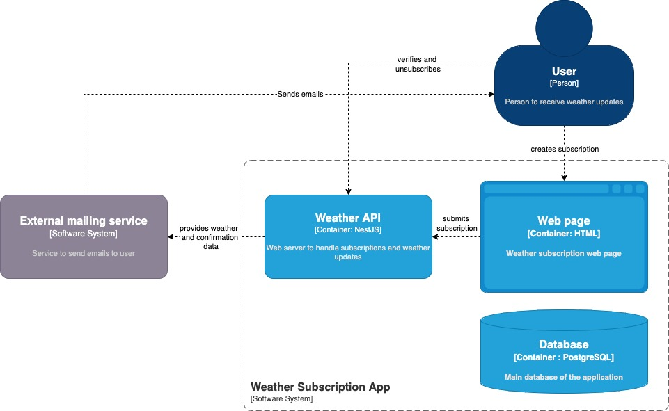

# System design: Weather Subscription API

## Огляд 
Застосунок, який дозволяє користувачам підписуватись на щогодинні або щоденні оновлення погоди у вибраному місті

## 1. Вимоги системи

### Функціональні вимоги
- Користувач може створити підписку на щогодинні або щотижневі оновлення стану погоди в певному місті
- Сервіс може надсилати регулярні листи з відповідним повідомленням про погоду в місті
- Користувач може проходити підтвердження наявності доступу до електронної адреси
- Користувач може відписатись від регулярних оновлень
- Сервіс надає шлях для отримання стану погоди в вказаному місті
- Застосунок має користувацький інтерфейс для створення підписки

### Нефункціональні вимоги
- **Доступність:** 99.9% безвідмовної роботи
- **Масштабованість:** до 250 тисяч користувачів, 5М повідомлень / день
- **Затримка:** < 500мс для API запитів
- **Надійність:** Гарантоване отримання оновлень
- **Безпека:** Валідація даних, підтвердження електронної адреси

### Обмеження
- Бюджет: мінімальна інфраструктура
- Неточні дані для невеликих міст
- Залежність від стороннього сервісу
- Кількість запитів до зовнішнього сервісу: 1 000 000 / місяць

## 2. Оцінка навантаження

### Користувачі та трафік
- Активні користувачі: 50 тисяч
- Підписки на користувача: 1-2
- API запити: 3000 RPS
- Повідомлення: 1М / день

### Дані
- **Підписка:** ~200 байтів
- **Кеш погоди:** ~150 байтів
- **Загальний обсяг:** ~10 Гб / рік

### Пропускна здатність
- **Вхідна:** 2 Mbps
- **Вихідна:** 10 Mbps
- **Зовнішній сервіс:** 50 Mbps

## 3. High-Level архітектура

## 4. Детальний дизайн компонентів

### 4.1 Subscription Module

#### Відповідальність:
- Створення підписки для користувача
- Верифікація електронної пошти
- Надсилання електронного листа зі станом погоди для обраного міста
- Скасування відписки для користувача
- Отримання активних підписок

#### Ендпойнти:
`POST /subscribe`  
`GET /confirm/:token`  
`GET unsubscribe/:token`  

### 4.2 Weather Module

#### Відповідальність:
- Надання даних про погоду в реальному часі
- Періодичне надсилання листів з оновленнями

#### Ендпойнти:
`GET /weather?city=`  

## 5. Схема бази даних

### Subscription

**id:** UUID  
**email:** VARCHAR  
**city:** VARCHAR  
**frequency:** ENUM
**token:** VARCHAR  
**confirmed:** BOOLEAN  
**createAt:** TIMESTAMP  

## 6. Стек технологій

- Node.js, NestJS
- PostgreSQL
- TypeORM
- Nodemailer
- @nestjs/schedule
- HTML, CSS
- Jest

## 7. Заходи безпеки

- Безпечне зберігання API ключів та облікових даних електронної пошти в файлі .env
- Обмеження кількості запитів
- CSRF/XSS 
- Валідація вхідних даних
- Використання протоколу HTTPS

## 8. Стратегія розгортання 
- CI/CD pipelines
- Різні середовища: dev, staging, production
- Розгортання на хостингу Render
- Контейнирезація з допомогою Docker